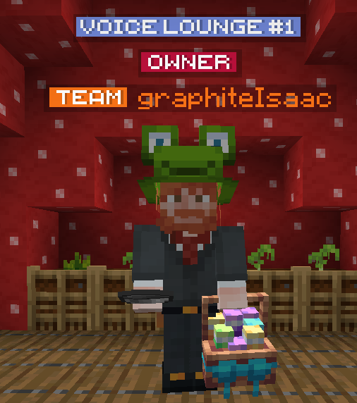

# Communication

## Chat Rooms

Chat rooms are areas in which you can talk with others in the same space. They offer an easy way to talk with others, with messages you send only being visible to others within the same chatroom and global chat being hidden. Chatrooms are currently found within the barn, spawn treehouse, auction house, and more.

## Emoji

You can send emoji in chat by typing a `:` and pressing tab. Origin Realms has over 80+ emoji to choose from, including but not limited to the `:heart:` 💖 and `:smile:` :smile:. Some emoji are free, however others may require a **VIP rank or above** to use.

## Tagging

You can tag other players by prefixing their username with an `@` in chat. This notifies the player by playing a sound and highlighting the ping to get their attention. e.g. `@KodingDev Hey, how's it goin?`. If a player you tag is AFK, you will be notified as such.

## Speech Bubbles

When you are near a player and send a chat message, a preview of that message will appear above the other user's head. This helps you identify who's speaking when near each other.

## Voice Chats

If your Discord account is linked, your current voice channel will appear above your head in-game. This helps others find players to talk to in Discord, live updating if you switch channels or disconnect.

