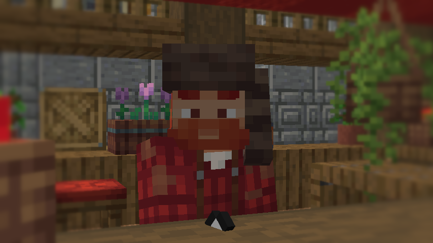

# NPC's

## 0R-Bit

0R-Bit is one of the first NPC's you will see when you visit the Origin Isles. It is a friendly welcoming bot that should set you off on the right path.&#x20;

## Jacko

Jacko run's Jacko's farm at the North end of the isles. He will sell you seeds for your farm, and will also buy any produce you create. A good starting way of making some rubies.&#x20;

## Jeckyl

Jeckyl will sell you planters, soil and multipliers for the seeds you buy from Jacko. A lot of the crops you buy from Jacko can only be planted in planters, rather then on the ground, so make sure you pick a few of them up.&#x20;

## Pebble

Pebble will repair your broken items that you have tried to enchant. There is a chance of destruction for some enchants, and when this happens, your item will be in a broken state and will need to be repaired.&#x20;

## Boulder

Boulder will enchant your relic items. (Needs to be corrected).

## Witch Hazel

Witch Hazel will buy and sell some nether based items like Glowstone Dust and Nether Wart.

## Bolt

Bolt will buy and sell some redstone based items like Pistons and Repeaters.

## Clay

..

## Ribston

Ribston sell's items based around wood, like saplings, leaves and logs.&#x20;

## Paula

Paula sells apples.

## Worker Shane

Worker Shane sells building materials like Granite and Terracotta

## Valdon

Valdon deals in mob ware, bones, gunpowder, spider eyes... that kinda stuff.

## Lily

Lily is florest and deals in flowers.&#x20;

## Captain Walrus

Captain Walrus buys and sells fish and coral.&#x20;

## Bartender Liam

Not much is known about what Bartender Liam sells, but we know you need the Arcade's gold pass to access him.&#x20;
